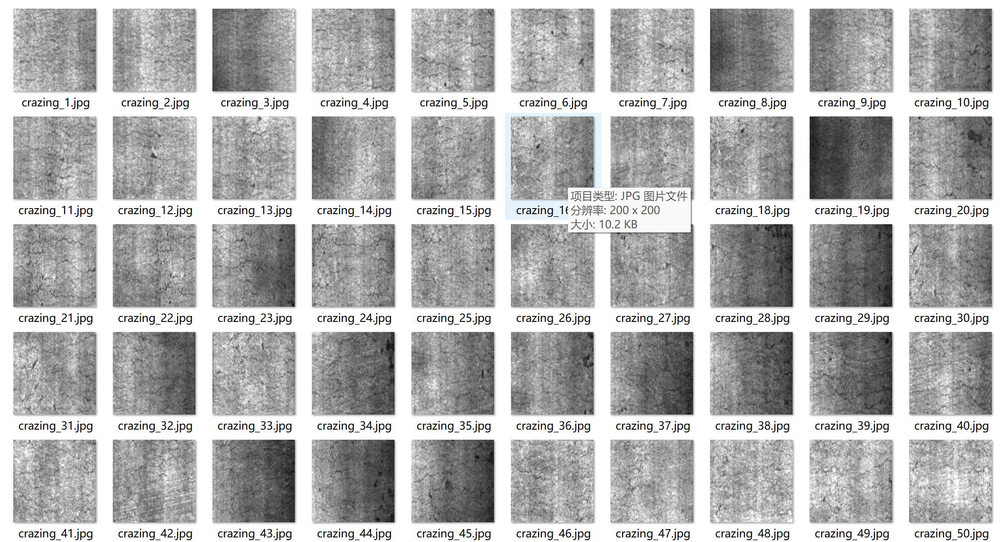
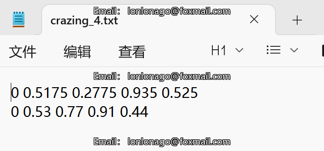
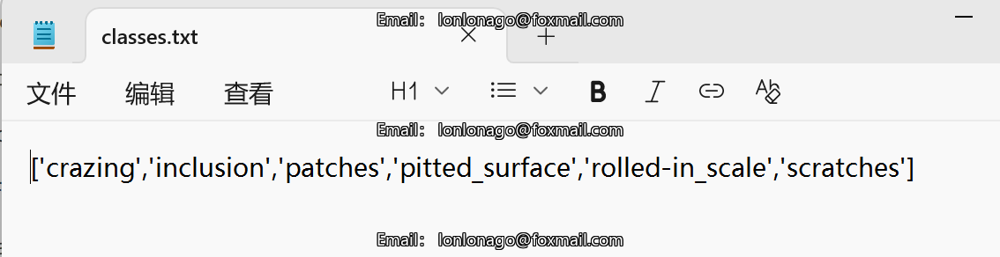
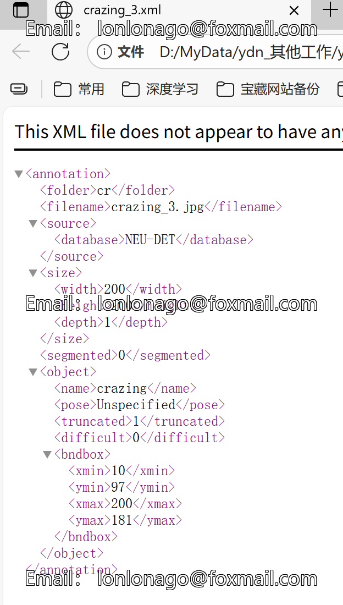
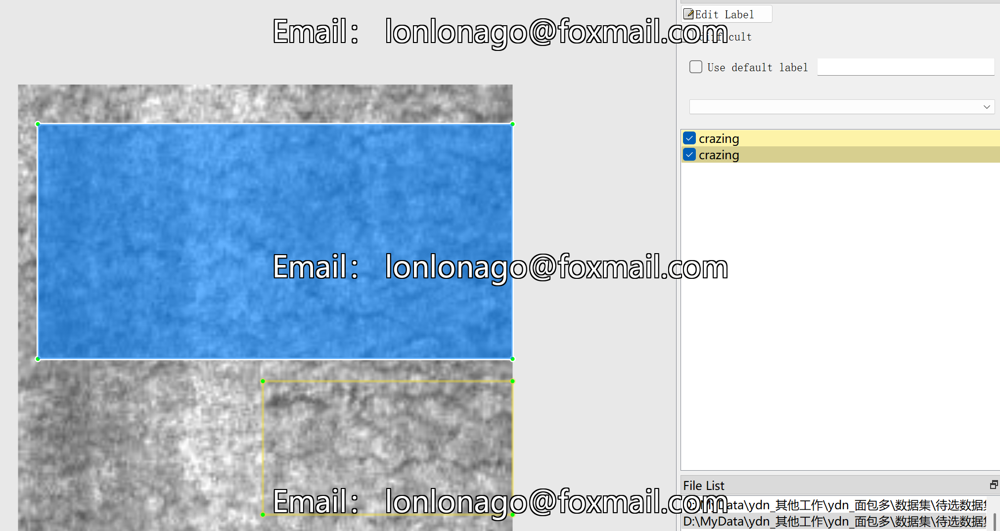

# Steel Surface Defects Target Detection Dataset

Dataset Information Introduction: The dataset consists of 3600 images and corresponding annota- tion files. The format of the annotation files includes two types: VOC formatted xml files and YOLO formatted txt files.

[crazing', 'patches', 'inclusion', 'pittedsurface', 'rolled-inscale', 'scratches']
The number of images and bounding box counts for each category are as follows: (Annotations are generally written in English, with Chinese provided within parentheses for reference)

Note: An image may be labeled with multiple objects, so the total number of bounding boxes may exceed the number of images.

The complete dataset includes three folders and a txt file:
all_txt folder and classes.txt: Store the YOLO formatted txt annotations, in the same quantity as the images, with each annotation file corresponding to one image.
classes.txt:
all_xml file: VOC formatted xml annotation files. The number matches that of the images, with each annotation file corresponding to one image.
Detailed explanations on how to view the standard VOC format can be found by searching online.
Both formats of annotations are compatible and may be used whichever one is chosen.
Annotation screenshot examples:

## Picture

Here is a pay link on Stripe ( https://buy.stripe.com/3cs8yP7sY87d0vu9AB ). Please contact me lonlonago@foxmail.com after funding $89, and I will send you a complete data files , thank you!

